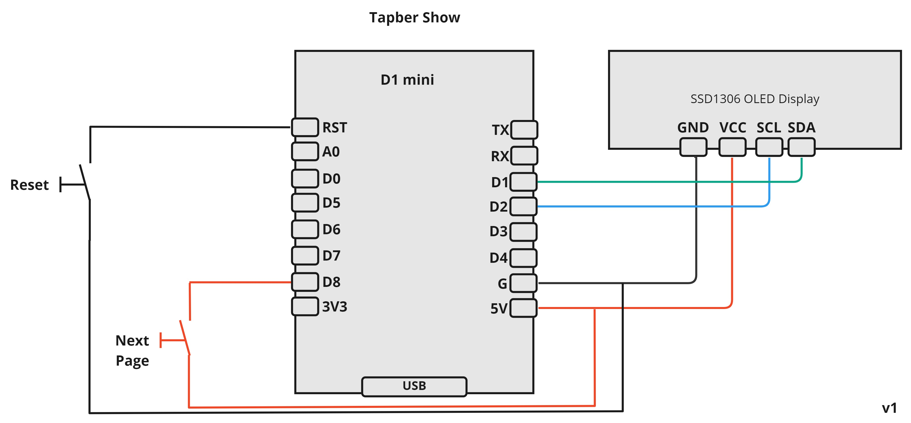

# Tapber Show

ESP8266 System that requests current prices from tibber api and calculates the prices of an action according to an predefined energy usage profile

Hardware:

- ESP8266 Wemos D1 Mini
- SSD1306 Mini OLED Display
- Button to Reset

Current State:

- [x] Access WIFI
- [x] Access Tibber API
- [x] Read price Information and make them available as JSON
- [x] Add test energy usage profile
- [x] Add Screen to show connection state
- [x] Add Screen to show current price
- [x] Add Screen to show action price (now)
- [x] Add Screen to show best price for action
- [x] Add File to centralize useage profiles
- [ ] Cleanup Code
- [x] Add more Screens to provide more detailed informations
- [x] Create 3d model housing
- [x] Support done timer devices

